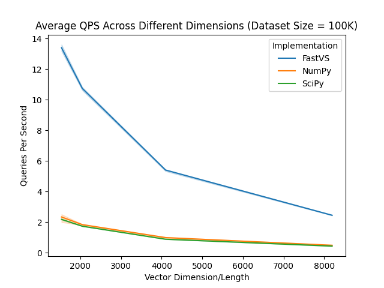

# FastVS

[](https://github.com/dm4ml/fastvs/actions?query=workflow:"CI")
[](https://badge.fury.io/py/fastvs)
[](https://opensource.org/licenses/MIT)

FastVS (Fast Vector Search) is a Python library designed for exact vector search in tables. It provides functionality to work with both PyArrow Tables and Pandas DataFrames, allowing users to perform nearest neighbor searches using various distance metrics. It is most optimized for PyArrow Tables, as it uses the Rust Arrow library under the hood for zero-copy and vectorized computation.

Note: FastVS only supports f64 (64-bit floating point) vectors as of now.

Here is a rough comparison of the performance of FastVS vs. scipy.spatial.distance.cdist (over 10 trials):



You should probably not use FastVS if you are working with large datasets and want approximate nearest neighbor search.

## Installation

FastVS can be installed using pip:

```bash
pip install fastvs
```

## Functions

FastVS offers the following main functions:

### `search_arrow`

Searches a PyArrow Table for the k nearest neighbors of a query point.

#### Parameters

- `table` (pyarrow.Table): The table to search.
- `column_name` (str): This column should be a list or np array type column, where each element is a vector of floats.
- `query_point` (list or np array): The query point.
- `k` (int): The number of nearest neighbors to return.
- `metric` (str): The metric to use for the search (e.g., "euclidean", "manhattan", "cosine_similarity", "inner_product").

#### Returns

- Tuple[List[int], List[float]]: The indices and distances of the k nearest neighbors.

#### Usage

```python
import pyarrow as pa
from fastvs import search_arrow

indices, distances = search_arrow(your_pyarrow_table, "your_column", [1.0, 2.0], 5, "cosine_similarity")
```

### `search_pandas`

Searches a Pandas DataFrame for the k nearest neighbors of a query point. This function uses `search_table` under the hood. Note that this function is slower than `search_arrow` due to the copying of data from the DataFrame to the Arrow table format.

#### Parameters

- `df` (pandas.DataFrame): The DataFrame to search.
- `column_name` (str): The column name to search. This column should be a list or np array type column, where each element is a vector of floats.
- `query_point` (list or np array): The query point.
- `k` (int): The number of nearest neighbors to return.
- `metric` (str): The metric to use for the search.

#### Returns

- Tuple[List[int], List[float]]: The indices and distances of the k nearest neighbors.

#### Usage

```python
import pandas as pd
from fastvs import search_pandas

df = pd.read_csv("your_dataset.csv")
indices, distances = search_pandas(df, "your_column", [1.0, 2.0], 5, "cosine_similarity")
```

### `apply_distance_arrow`

Applies a distance function to a PyArrow table and returns an array of distances.

#### Parameters

- `table` (pyarrow.Table): The table to search.
- `column_name` (str): The column name to search. This column should be a list or np array type column, where each element is a vector of floats.
- `query_point` (list or np array): The query point.
- `metric` (str): The metric to use for the search.

#### Returns

- pyarrow.Array: The distances in the order of the table.

#### Usage

```python
import pyarrow as pa
from fastvs import apply_distance_arrow

table = pa.Table.from_pandas(your_dataframe)
distances = apply_distance_arrow(table, "your_column", [1.0, 2.0], "euclidean")
```

### `apply_distance_pandas`

Applies a distance function to a Pandas DataFrame and returns a Series of distances. Uses `apply_distance_arrow` under the hood.

#### Parameters

- `df` (pandas.DataFrame): The DataFrame to search.
- `column_name` (str): The column name to search. This column should be a list or np array type column, where each element is a vector of floats.
- `query_point` (list or np array): The query point.
- `metric` (str): The metric to use for the search.

#### Returns

- pandas.Series: The distances as a pandas Series.

#### Usage

```python
import pandas as pd
from fastvs import apply_distance_pandas

df = pd.read_csv("your_dataset.csv")
distances = apply_distance_pandas(df, "your_column", [1.0, 2.0], "euclidean")
```

## Supported Metrics

FastVS supports various distance metrics, including:

- Euclidean ("euclidean")
- Manhattan ("manhattan")
- Inner Product ("inner_product")
- Cosine Similarity ("cosine_similarity")

#### Euclidean Distance

The Euclidean distance between two points $P$ and $Q$ in $N$-dimensional space, with $P = (p_1, p_2, ..., p_N)$ and $Q = (q_1, q_2, ..., q_N)$, is defined as:

```math
 d(P, Q) = \sqrt{\sum_{i=1}^{N} (p_i - q_i)^2}
```

#### Manhattan Distance

The Manhattan distance (also known as L1 norm) between two points $P$ and $Q$ in $N$-dimensional space is the sum of the absolute differences of their Cartesian coordinates:

```math
 d(P, Q) = \sum_{i=1}^{N} |p_i - q_i|
```

#### Cosine Similarity

Cosine similarity measures the cosine of the angle between two vectors $P$ and $Q$ in an $N$-dimensional space. It is defined as:

```math
 \text{Cosine Similarity}(P, Q) = \frac{P \cdot Q}{\|P\| \|Q\|}
```

where$P \cdot Q$is the dot product of vectors $P$ and $Q$, and $|P|$ and $|Q|$ are the magnitudes (Euclidean norms) of vectors $P$ and $Q$, respectively.

#### Inner Product

The inner product (or dot product) between two vectors $P$ and $Q$ in an $N$-dimensional space is defined as the sum of the products of their corresponding components:

```math
 \text{Inner Product}(P, Q) = P \cdot Q = \sum_{i=1}^{N} p_i q_i
```

## Contribution

Contributions to FastVS are welcome! Please submit your pull requests to the repository or open an issue for any bugs or feature requests.

To Dos:

- [ ] Clean up rust code
- [ ] Support f32

## License

FastVS is released under the MIT License. See the LICENSE file in the repository for more details.
